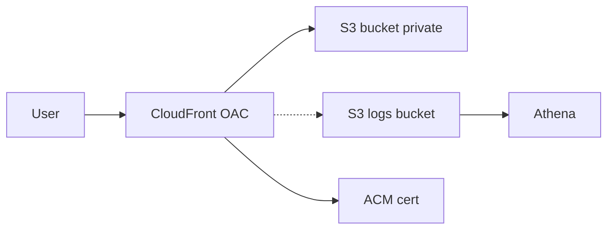

# Project 1 - Static Site on AWS: S3 + CloudFront (OAC) + HTTPS + Logs -> Athena

> Objective: low-latency static delivery with a basic security perimeter and cost awareness.

## Architecture (mermaid)

  
## Steps (how to run)

1. S3 (private): create bucket, enable **Block Public Access** and **Versioning**.  
2. CloudFront (OAC): create distribution with S3 as origin using **Origin Access Control**.  
3. HTTPS: request **ACM** certificate (if you own a domain, use Route 53; otherwise keep `*.cloudfront.net`).  
4. Logs: enable CloudFront **standard logs** to a **logs bucket**.  
5. Athena: create a table for the logs and run **1 sample query**.

## Security (minimum)

- Least-privilege IAM for the deploy user/role.  
- S3 **private** + bucket policy only for CloudFront **OAC**.  
- TLS via **ACM**; rotate keys; MFA on the account.

## Cost (FinOps)

- Estimate using **AWS Pricing Calculator** (few dollars/month at low traffic).  
- Tag everything: `env=lab`, `owner=nill`, `cost-center=study`.  
- Set **Budgets (USD 5)** + **Cost Anomaly Detection**.

## Validation (what proves it works)

- Paste the CloudFront URL here: `https://xxxxxxxx.cloudfront.net/`  
- Add a screenshot of the **Athena** query result (top IPs, status codes).

## References

- AWS docs: S3, CloudFront (OAC), ACM, Athena.  
- AWS Well-Architected Framework (security & cost pillars).
